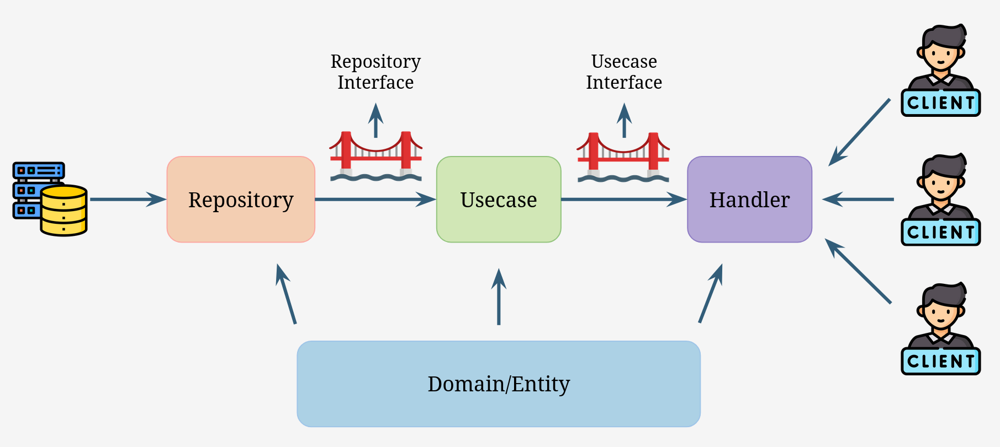

# A Tasks Management REST API written in Go using Clean Architecture
A simple Golang backend project on my journey of learning clean architecture using Gin, MYSQL, JWT Authentication.
## Table of contents
## Clean Architecture
Clean architecture is a software design principle proposed by Robert C. Martin ([see here](https://blog.cleancoder.com/uncle-bob/2012/08/13/the-clean-architecture.html)) that aims to achieve the separation of concerns by dividing the software into layers. 

The architecture produces systems that are independent of frameworks, testable, and independent of UI, database, and any external agency. The Dependency Rule, which states that source code dependencies can only point inwards, makes this architecture work. 

Clean architecture typically consists of four layers: entities, use cases, interface adapters, and frameworks and drivers.

The examples in this repository demonstrate the implementation of Clean Architecture in Golang.
### Architecture Layers

### Folder Structure
```
tasks-go-clean-architecture
├── bootstrap
│   └── env.go
├── cmd
│   └── main.go
├── database
│   └── mysql
│       ├── migrations
│       │   ├── 000_create-database.sql
│       │   ├── 001_create-schema.sql
│       │   └── 002_seeds-data.sql
│       └── mysql.go
├── go.mod
├── go.sum
├── internal
│   ├── delivery
│   │   └── http
│   │       ├── handler       -> outermost layer driving the business logic
│   │       │   ├── handler.go
│   │       │   └── interface.go
│   │       ├── middleware
│   │       │   └── jwt_auth_middleware.go
│   │       └── route
│   │           └── route.go
│   ├── domain
│   │   ├── entity            -> entity encapsulate business rules (struct with methods)
│   │   │   ├── task.go
│   │   │   └── user.go
│   │   └── interface
│   │       ├── repository    -> repository interface bridge repository and usecase layer
│   │       │   ├── task.go
│   │       │   └── user.go
│   │       └── usecase       -> usecase interface bridge usecase and handler layer
│   │           ├── login.go
│   │           ├── refresh_token.go
│   │           ├── signup.go
│   │           └── task.go
│   ├── repository            -> implementation of repository layer
│   │   ├── taskrepo
│   │   │   └── repository.go
│   │   └── userrepo
│   │       ├── model.go
│   │       └── repository.go
│   └── usecase               -> implementation of usecase layer
│       ├── login
│       │   └── login_usecase.go
│       ├── refreshtkn
│       │   └── refresh_token_usecase.go
│       ├── signup
│       │   └── signup_usecase.go
│       └── tasks
│           └── task_usecase.go
├── pkg                        -> utilities, helpers, ...
│   └── tokenutil
│       └── tokenutil.go
└── README.md
```
### Domain
#### Entities
- User
- Task
#### Interfaces
- Usecase Interfaces
- Repository Interfaces
### Usecase
### Repository
## API

- POST `/api/signup`: Sign up
- POST `/api/login`: Login
- GET `/api/task`: Fetch all tasks of user
- POST `/api/task/add`: Add a task
- PUT `/api/task/{id}`: Toggle complete status of a task
- DELETE `/api/task/{id}`: Delete a task

## Set Up
## References
